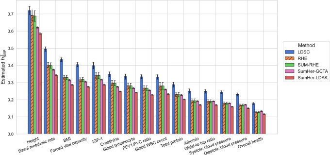
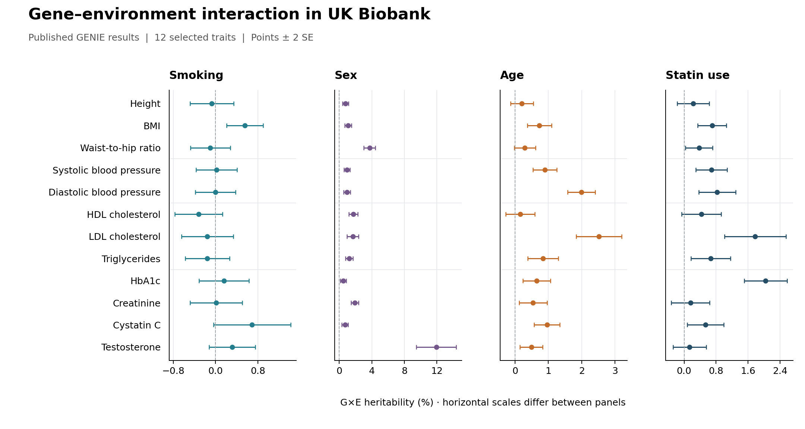

# Real-data results

Published UK Biobank analyses illustrate heritability estimation and
gene–environment interaction. These figures contain aggregate estimates only.

## SNP heritability

SUM-RHE, the heritability method underlying SUMMIT, was applied to 291,273
unrelated white British participants and 454,207 common array SNPs. The figure
shows 15 traits selected by the largest SUM-RHE estimate-to-standard-error
ratios. SUM-RHE estimates closely follow those from individual-level RHE.



Reproduced without modification from Figure 5 of
[Jeong et al., Genome Research (2024)](https://doi.org/10.1101/gr.279207.124),
under [CC BY 4.0](https://creativecommons.org/licenses/by/4.0/).
These are results from the published SUM-RHE implementation.

For commands, see [Heritability and genetic correlation](Heritability-and-genetic-correlation.md).

## Gene–environment interaction

GENIE estimates additive genetic variance, G×E variance, and environment-dependent
residual variance. Its published UK Biobank analysis used 291,273 unrelated white
British participants and 454,207 common array SNPs. Each exposure was fitted
separately, standardized, and included among the fixed effects.



The plot redraws published GENIE estimates for 12 traits spanning body size,
blood pressure, lipids, and biomarkers. The same traits appear in every panel;
they were selected for illustration, without a significance threshold.
Bars show ±2 standard errors. Horizontal scales differ between panels, and
negative estimates are retained. These associations do not establish causal
effects of the exposures.

The results come from the individual-level GENIE implementation described in
[Pazokitoroudi et al., AJHG (2024)](https://doi.org/10.1016/j.ajhg.2024.05.015).
SUMMIT's summary-based implementation of the one-environment model is described
in [G×E models](GxE-models.md); this figure illustrates the published model,
not a comparison of the two implementations.

### Plot data and reproduction

The [GENIE result tables](https://github.com/sriramlab/GENIE/tree/fd47d9265fae093b1fbc6aaec3086d99c3b9bad8/results/real_data/array_snps)
provide the `h2gxe` and `h2gxe.se` columns used here. We used `all.age.norm.txt`
and the `all.{smok,sex,statin}.norm.def.txt` tables.

- [Plotted estimates and standard errors (CSV)](assets/genie-published-gxe.csv)
- [Vector figure (SVG)](assets/genie-published-gxe.svg)
- [Plotting script](../../example/plot_published_results.py)

From the repository root, with Matplotlib installed:

```bash
python example/plot_published_results.py
```

This writes PNG and SVG files to `example/out/published-results/` using only the
supplied aggregate table. It does not require participant data.
