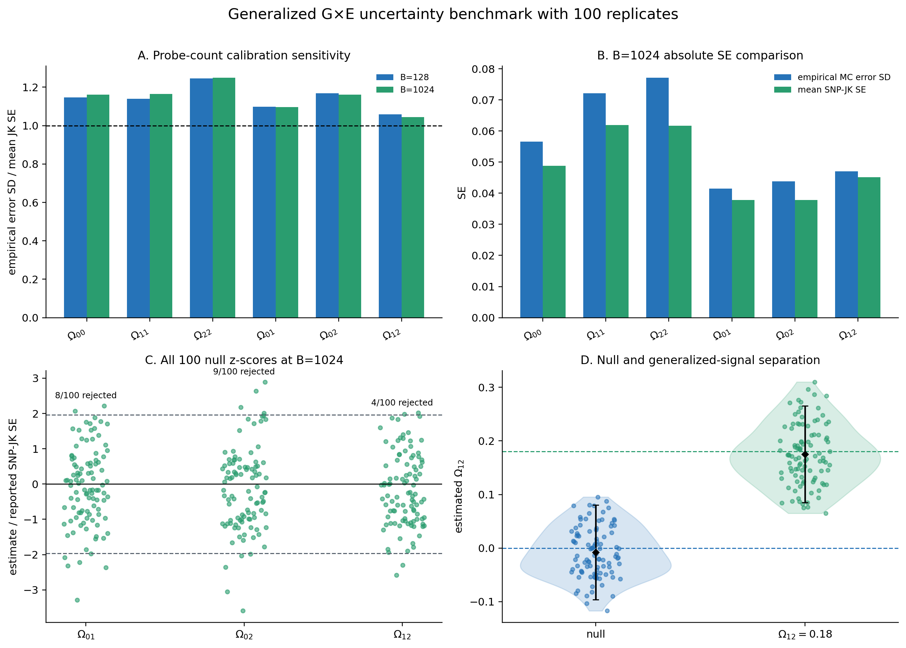

# Generalized GxE benchmark: validated results

Date: 2026-08-23

## Bottom line

The nuisance-matched 100-replicate benchmark qualifies the generalized GxE
inference workflow at B=1024 for the tested N approximately 10,000, Q=3,
all-variant configuration. All predeclared calibration and signal-recovery
gates pass.

B=128 is not qualified for this configuration. Its SNP-jackknife SE scale is
reasonable, but finite-probe separation error shifts two null genetic
coefficients along nearly canceling genetic/residual nuisance directions.

The inference design includes all six symmetric residual-context kernels

```text
P diag(eta_qr * phi_q * phi_r) P.
```

Only the identity residual coefficient has nonzero generating truth. Results
from a preliminary fit that omitted these required nuisance kernels are not
part of the qualification evidence and have been removed from the repository.



## Null calibration

For a null component, the empirical error SD is the sample SD of the 100 point
estimates. It directly estimates the unknown repeated-sampling SE and has
approximately 7% relative Monte Carlo uncertainty at R=100.

| Null component | B | Mean estimate | Empirical error SD | 95% population-SD interval | Mean SNP-JK SE | Empirical/J-K | Rejected |
|---|---:|---:|---:|---:|---:|---:|---:|
| Omega[0,1] | 128 | -0.00571 | 0.04018 | 0.03528--0.04668 | 0.03659 | 1.10 | 8/100 |
| Omega[0,2] | 128 | +0.02657 | 0.04618 | 0.04055--0.05365 | 0.03955 | 1.17 | 13/100 |
| Omega[1,2] | 128 | +0.03542 | 0.04816 | 0.04228--0.05595 | 0.04550 | 1.06 | 16/100 |
| Omega[0,1] | 1024 | -0.00332 | 0.04149 | 0.03643--0.04820 | 0.03786 | 1.10 | 8/100 |
| Omega[0,2] | 1024 | -0.00558 | 0.04384 | 0.03849--0.05093 | 0.03778 | 1.16 | 9/100 |
| Omega[1,2] | 1024 | -0.00781 | 0.04709 | 0.04134--0.05470 | 0.04513 | 1.04 | 4/100 |

At B=1024 the empirical estimates of the three null SEs are 0.0415, 0.0438,
and 0.0471. The corresponding reported mean SNP-jackknife SEs are 0.0379,
0.0378, and 0.0451: approximately 9%, 14%, and 4% low. The ratios pass the
sealed 0.75--1.35 calibration band, and the rejection rates pass the 10%
ceiling.

At B=128, the empirical/J-K ratios also pass. Its failed rejection gate comes
from fixed point shifts of +0.0266 and +0.0354, which move close to zero at
B=1024 while the paired residual coefficients move oppositely. This is the
observed finite-probe sensitivity that makes B=1024 the required setting.

## Generalized signal recovery

The off-diagonal scenario has mean Omega[1,2] truth 0.18051. At B=1024:

- the mean estimate is 0.17491;
- the empirical error SD is 0.05702;
- the mean SNP-jackknife SE is 0.04604; and
- 94/100 replicates reject zero.

The diagonal genetic restriction has no Omega[1,2] parameter. Biologically,
the simulated signal means that alleles increasing sensitivity to one
environment tend systematically to increase sensitivity to the second. That
shared cross-environment response architecture cannot be represented by a
GENIE-style diagonal genetic covariance.

## Work and artifact accounting

Each 100-phenotype simulation batch used exactly one genotype traversal,
454,207 retained-variant visits, 111 decoded blocks, and zero missing calls.
The two scenarios were combined into one 200-phenotype trait traversal. The
sealed B=128 and B=1024 references retain their original exact two-pass,
908,414-visit clean ledgers; reuse did not access reference genotypes again.

The B=1024 machine result is
`/home/bronsonj/SUMMIT_generalized_GxE_benchmarks_20260823/simulation_r100_b1024_full_residual_final/simulation_benchmark.json`.
Its `stop_gates.all_passed` field is true.

## Qualification scope

- Qualified: Linux x86-64, FP64, descriptor-owned imputed PLINK BED, pinned
  private pthread-BLIS, N approximately 10,000, Q=3, all variants, B=1024,
  complete residual-context nuisance basis.
- Not qualified for this design: B=128.
- The benchmark is conditional on one sealed pair of environment vectors;
  effects and noise vary independently across replicates.
- The prior real-age diagonal restriction remains a valid mature-estimator
  comparison. No off-diagonal real-age result from the incomplete nuisance
  design is published.
